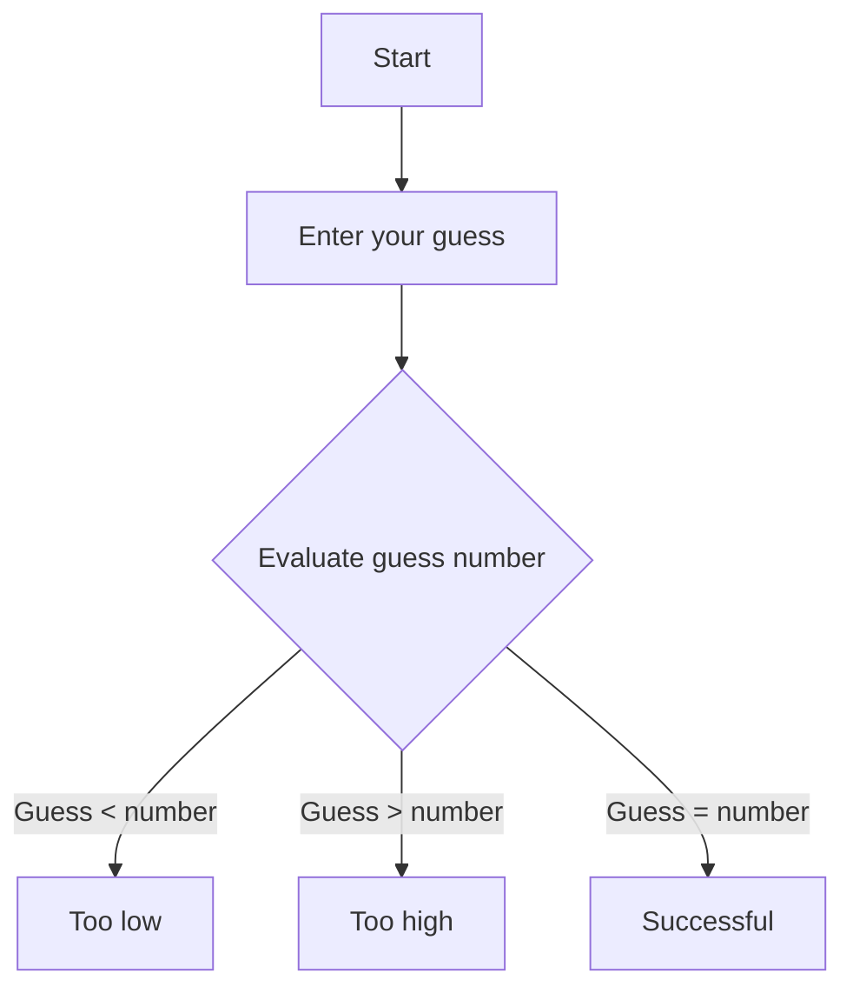

```mermaid
flowchart TD
   Start -->
    A[Enter your guess]
    A --> C{Evaluate guess number}
    C -->|Guess < number| D[Too low]
    C -->|Guess > number| E[Too high]
    C -->|Guess = number| F[Successful]
```

